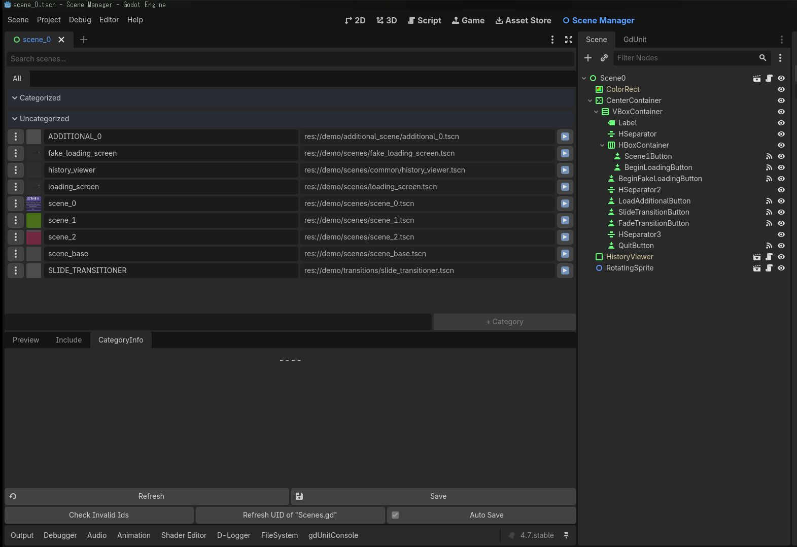

# Scene Manager

<p align="center">

</p>

Godot 4向けの包括的なシーンライフサイクル管理アドオンです。シーンを管理するためのエディタ、自動生成されるシーン列挙型、排他的/加算的ローディングパターン、CanvasLayerラッピングによるレイヤーベースのシーン管理、スムーズなビジュアルトランジションをサポートしています。

オートコンプリートノードは https://github.com/Lenrow/line-edit-complete-godot の Lenrow によって組み込まれ、変更されました。

## 機能

* **シーン組織化と管理**
  - シーン管理とカテゴリ分けのためのエディタUI
  - シーン名とカテゴリ名の重複チェック
  - 指定パスでシーンを自動検出するインクルードフォルダ機能
  - 自動生成 `Scenes.Id` 列挙型 + ユーティリティ関数（`get_scene()`, `get_scene_path()`）
  - インスペクタベースのシーン選択と自動補完用に `SceneResource` プロパティをエクスポート
  - ファイルシステム監視 — `.tscn` ファイルの変更を自動同期
  - FileSystemドックから `.tscn` ファイルをドラッグ＆ドロップで登録
  - エディタパネルでのシーン名検索/フィルタ
  - 無効な `Scenes.Id` 参照の検出ツール
  - サムネイルプレビューとSubViewportでのトランジションプレビューパネル

* **複数のローディングパターン**
  - 排他的シーンローディング（`switch_to_scene`）— 既存の全シーンを新しいものに置き換え
  - 加算的シーンローディング（`add_scene`）— 複数のシーンを同時にロード
  - 重複名ハンドリングモード: 削除、警告/スキップ、リネーム、既存レイヤーに追加
  - ID指定でのシーン削除（`remove_scene`）またはノード名でのアンロード（`unload_scene_by_name`）
  - シーンリロード機能

* **レイヤー・プライオリティシステム**
  - z-インデックス順序付きCanvasLayerベースのシーンラッピング
  - シーンレンダリング順序のプライオリティシステム
  - 下位層のポーズ/プロセス制御
  - レイヤーごとのビューポートフォロー設定
  - 空のレイヤーの自動削除

* **シーン履歴とナビゲーション**
  - リングバッファベースのシーン履歴（前のシーンに戻る）
  - オフセットベースの履歴ナビゲーション
  - 履歴クリア、現在のシーンをリロード
  - シーンマネージャをリセットして履歴をクリアし、現在のシーンを最初として想定

* **インターフェースサポート**
  - `ISceneInitializer` — 初期化中に新しいシーンにパラメータを渡す
  - `IFadeInNotify` — フェードイン・トランジション終了時に通知を受け取る
  - `IFadeOutNotify` — フェードアウト・トランジション開始/終了時に通知を受け取る

* **ビジュアルトランジション**
  - 組み込みのフェードイン/フェードアウト（黒）
  - カスタマイズ可能なトランジション時間（play_out_time、play_in_time）
  - トランジション中の入力ブロック
  - `ScreenTransitioner` ベースクラスによるカスタムトランジショナー対応（ロードごとにカスタムID指定可能）
  - トランジショナー未設定時のNoOpトランジェショナーフォールバック
  - SubViewportでのエディット中トランジションプレビュー
  - スライドトランジショナーのデモ付属

* **非同期ローディングと進捗表示**
  - 進捗トラッキング(0-100%)付きスレッド化リソースローディング
  - バッチリソースローディングサポート
  - トランジションシーン(ローディング画面)での事前インスタンス化
  - シーンインスタンス化前のコールバックフック
  - 2段階非同期フロー: `load_scene_with_transition` → `instantiate_async_result` → `activate_prepared_scene`

* **包括的なシグナルサポート**
  - `load_percent_changed(value: int)` — 非同期ローディング進捗
  - `load_finished` — 非同期ロード完了
  - `load_failed` — 非同期ロード失敗
  - `scene_loaded(scene_id: Scenes.Id, node: Node)` — シーンインスタンス化とツリーへの追加完了
  - `scene_transition_completed(scene_id: Scenes.Id)` — トランジション完全完了（視覚エフェクト含む）
  - `category_changed(diff: SMgrData.CategoryDiff)` — シーンカテゴリ変更
  - `category_reapplied(tags: Array[Scenes.CategoryId])` — 同一IDのシーンがリロードされ、カテゴリが再適用された
  - `category_tags_notified(tags: Array[Scenes.CategoryId])` — カテゴリがリスナーに通知
  - `on_game_end` — ゲーム終了開始

* **エディタ統合**
  - シーン/カテゴリ管理のためのリアルタイムエディタパネル
  - タブベースUI: 「すべて」タブ（カテゴリあり/なし）+ カテゴリ別タブ
  - カテゴリプロパティ編集: プライオリティ、ポーズ動作、常時プロセス、ビューポートフォロー、レイヤー名
  - プライオリティマップの可視化（ソート可能な棒グラフ）
  - インクルードパス管理（パスごとのカテゴリ割り当て）
  - 未保存変更通知 + 手動/自動保存トグル
  - Scene Managerタブから直接シーンを開く
  - プロジェクト設定統合によるアドオン設定
  - `SceneResource` インスペクタプロパティでの自動補完
  - 外部変更を自動再読み込みするファイル監視
  - リソース競合解決用のUID更新ツール

## 使用方法

1. `addons` フォルダから `scene_manager` フォルダをプロジェクトの `addons` ディレクトリにコピーしてください。（`scene_manager` フォルダの名前を変更しないでください）
2. **`プロジェクト > プロジェクト設定...`** を開き、**`プラグイン`** タブに移動して `scene_manager` プラグインを有効にしてください。
3. エディタの右側に **`Scene Manager`** タブが表示されます（デフォルトテーマビュー）。
4. このタブを使用して以下を行います：
   - シーンカテゴリの作成と整理
   - マネージャにシーンを追加
   - レイヤープライオリティ、ポーズ動作、レイヤー名を設定
   - インクルードパスとカテゴリ自動割り当てを設定
5. 変更後、自動保存が有効な場合は自動で保存され、無効な場合は **`保存`** をクリックします。

> **注意**: Scene Managerプラグインを有効化すると、2つのオートロードが登録されます: `Scenes`（自動生成されたenum + ユーティリティクラス）と `SceneManager`（ランタイムAPI、クラス名 `SMgrInstance`）。ランタイムAPIには `SceneManager.switch_to_scene()` でアクセスし、`SceneManager.scene_transition_completed.connect(...)` でシグナルに接続します。

> **注意**: アドオンは `Scenes` クラスファイルを自動生成します。デフォルトでは `res://scene_manager_data/scenes.gd` に保存されます。このファイルを手動で編集しないでください — エディタUIによって上書きされます。

### シーン列挙型とリソース (Scene Enum & Resource)

ツールビューでシーンを追加すると、`Scenes.Id` 列挙型が自動生成されます。以下のユーティリティ関数も含まれます：

```gdscript
# シーンIDからPackedSceneを取得
var scene: PackedScene = Scenes.get_scene(Scenes.Id.LEVEL_1)

# シーンIDからファイルパスを取得
var path: String = Scenes.get_scene_path(Scenes.Id.LEVEL_1)
```

また、`SceneResource` クラスを使用することで、インスペクタ上でオートコンプリート付きのシーン選択プロパティをエクスポートできます：

```gdscript
@export var scene: SceneResource
```

## ツールビュー

シーンマネージャタブは、シーン管理のためのビジュアルインターフェースを提供します：

<p align="center">

</p>

- **検索バー** — 全カテゴリからシーン名でフィルタリング
- **「すべて」タブ** — カテゴリあり/なしのシーンを折りたたみ可能なセクションで表示
- **カテゴリ別タブ** — 各カテゴリが専用タブを持つ
- **カテゴリプロパティ** — カテゴリ名、レイヤー名、プライオリティ、ポーズ/常時プロセス/ビューポートフォローフラグを編集
- **プライオリティマップ** — 全カテゴリのプライオリティを棒グラフで可視化
- **シーンアイテム** — サムネイル、編集可能な名前、ファイルパス、カテゴリ割り当てポップアップを表示
- **インクルードパス** — ディレクトリ/ファイルを追加してシーンを自動検出、パスごとのカテゴリ割り当てドロップダウン付き
- **プレビューパネル** — シーンサムネイルプレビューと `ScreenTransitioner` シーンのトランジション再生
- **保存/自動保存** — 手動保存ボタン（自動保存オン時は無効化）、自動保存トグル
- **無効IDチェッカー** — プロジェクト内の古い `Scenes.Id` 参照をスキャン
- **ファイルドロップ** — FileSystemドックから `.tscn` ファイルをドラッグしてインクルードパスとして登録

<p align="center">

</p>

<p align="center">

</p>

### シーンカテゴリ

シーンカテゴリを使用すると、シーンを論理的に整理し、その動作を一緒に管理できます（ポーズ状態、レンダリングプライオリティなど）。各カテゴリに以下を割り当てることができます：

- **名前** — カテゴリの一意の識別子
- **レイヤー名** — カスタムCanvasLayerノード名（SceneLoadOptionsの `node_name` を上書き）
- **プライオリティ** — レンダリングのzオーダー（高いプライオリティは上に表示）
- **下位レイヤーをポーズ** — このプライオリティ以下のシーンをポーズするかどうか
- **常にプロセス** — ポーズ時でもこのシーンを処理するかどうか
- **ビューポートをフォロー** — このシーンのCanvasLayerがメインビューポートをフォローするかどうか

### インクルードパス

インクルードパスセクションにフォルダまたはファイルパスを追加することで、シーンを自動検出できます。これらのパスにあるシーンはマネージャに自動的に登録され、ファイル名から派生した列挙型名を持ちます。

<p align="center">

</p>

各インクルードパスにはドロップダウンでカテゴリを割り当てることができ、そのパス下の全シーンに自動的にそのカテゴリが割り当てられます。

## SceneManager API

アドオンを有効化した後、`SceneManager` オートロード（クラス名 `SMgrInstance`）を介してシーンマネージャにグローバルにアクセスできます。以下は最も一般的に使用される関数です。

### シーンのローディング

**新しいシーンに切り替える（排他的ローディング — 既存の全レイヤーを置き換え）：**
```gdscript
# Scenes.Id 列挙型を使用した簡単な切り替え
SceneManager.switch_to_scene(Scenes.Id.LEVEL_1, true)

# カスタムオプション付き
var options = SceneLoadOptions.new()
options.play_out_time = 0.5
options.play_in_time = 0.5
options.clickable = true  # トランジション中に入力を許可（デフォルト: false = ブロック）
SceneManager.switch_to_scene(Scenes.Id.LEVEL_1, true, options)

# または scene_loaded_cb コールバックを直接渡して早期アクセス
SceneManager.switch_to_scene(Scenes.Id.LEVEL_1, true, SceneLoadOptions.new(),
    func(node: Node):
        print("シーンが早期ロードされました: ", node.name)
)
```

**シーンを加算的に追加（他を削除せずに）：**
```gdscript
var options = SceneLoadOptions.new()
options.node_name = "UI"
SceneManager.add_scene(Scenes.Id.HUD, SMgrInstance.DuplicateNameMode.REMOVE_OLD, options)
```

**特定の加算シーンを削除：**
```gdscript
SceneManager.remove_scene(Scenes.Id.HUD)
```

**レイヤーノード名でシーンをアンロード：**
```gdscript
SceneManager.unload_scene_by_name("UI")
```

**トランジションシーン（ローディング画面）での非同期ローディング：**
```gdscript
# 1. ローディングフローを開始
SceneManager.load_scene_with_transition(
    Scenes.Id.LEVEL_2,        # ターゲットシーン
    Scenes.Id.LOADING_SCREEN, # ローディング画面シーン
    true,                     # 現在のシーンを履歴に追加
    SMgrInstance.DuplicateNameMode.WARN_AND_SKIP,
    SceneLoadOptions.new()    # ローディング画面のオプション
)

# load_scene_with_transition は第6引数に unload_old (bool) も受け付けます
```

```gdscript
# 2. ローディング画面でシグナルに接続
SceneManager.load_percent_changed.connect(func(percent: int):
    progress_bar.value = percent
)

SceneManager.load_finished.connect(func():
    # ロードされたシーンをインスタンス化（ローディング画面の背後に非表示で配置）
    SceneManager.instantiate_async_result()
    # 準備ができたらシーンをアクティブにしてトランジションを実行
    SceneManager.activate_prepared_scene()
)
```

```gdscript
# または、非同期ローディングを手動で開始
var reserved = SceneManager.get_reserved_scene()
SceneManager.start_async_load(reserved)

# 完了後:
SceneManager.instantiate_async_result()
# ... 後で ...
SceneManager.activate_prepared_scene()
```

### 履歴ナビゲーション

```gdscript
# 前のシーンに戻る
if not await SceneManager.load_previous_scene():
    print("履歴に前のシーンがありません")

# N個のシーンを戻る
SceneManager.back_to_previous_by_offset(2)

# 現在のシーンをリロード
SceneManager.reload_current_scene()

# 履歴情報を取得
var history: Array[Scenes.Id] = SceneManager.get_history_list()
var count: int = SceneManager.get_history_count()

# 履歴をクリア
SceneManager.clear_history()
```

### ユーティリティ関数

```gdscript
# フェード付きでゲームを終了
SceneManager.exit_game(1.0)  # fade_time は省略可能、デフォルト 1.0

# 現在のメインシーンのルートノードを取得
var current_node = SceneManager.get_current_scene_node()

# 非同期ロード中に予約されたシーン情報を取得
var reserved_id = SceneManager.get_reserved_scene()
var reserved_options = SceneManager.get_reserved_load_option()

# 生のシーンデータベースにアクセス (SMgrData)
var db: SMgrData = SceneManager.get_scene_data()
```

### SceneLoadOptions

`SceneLoadOptions` でシーンローディング動作をカスタマイズします：

```gdscript
@export var node_name: String = "World"   # 親CanvasLayerノード名
@export var play_out_time: float = 0.5    # フェードアウト時間（秒）
@export var play_in_time: float = 0.5     # フェードイン時間（秒）
@export var transition_id: Scenes.Id = Scenes.Id.NONE  # カスタムトランジショナーシーンID
@export var transition_layer: int = -1    # トランジションレイヤー（-1 = プロジェクトデフォルト）
@export var params: Variant = null        # ISceneInitializer 経由で渡すパラメータ
@export var clickable: bool = false       # false = トランジション中に入力をブロック

# コールバック
var pre_wrap_cb: Callable                 # レイヤーがツリーに追加される前に呼び出される
var pre_node_cb: Callable                 # シーンノードがレイヤーに追加される前に呼び出される
var scene_loaded_cb: Callable             # シーンがインスタンス化された後に呼び出される
```

コンストラクタのデフォルト値はプロジェクト設定から取得されます：

```gdscript
# すべての引数は省略可能
var options = SceneLoadOptions.new(
    "World",       # node_name
    false,         # clickable
    -1.0,          # play_out_time（負の値 = プロジェクトデフォルト使用）
    -1.0,          # play_in_time（負の値 = プロジェクトデフォルト使用）
    Callable(),    # pre_wrap_cb
    Callable(),    # pre_node_cb
    Scenes.Id.NONE, # transition_id
    -1,            # transition_layer
    Callable()     # scene_loaded_cb
)
```

`copy()` でディープコピー：

```gdscript
var copy = options.copy()
```

### DuplicateNameMode

`add_scene` が既存の同名レイヤーに遭遇した時の動作を制御します：

| モード | 動作 |
|---|---|
| `REMOVE_OLD` | 既存の SceneLayer を削除してから新しいものを追加 |
| `WARN_AND_SKIP` | 警告を表示して追加を中止 |
| `RENAME_NEW` | 新しい SceneLayer に数値サフィックスを追加 |
| `APPEND` | 新しいシーンノードを既存の SceneLayer に追加 |

### シーンローディングモード (Scene Loading Modes)

`SceneManager` は以下のローディングパターンをサポートしています：

* **排他的 (switch\_to\_scene)**: 既存のすべてのレイヤーを削除し、新しいレイヤーに置き換えます。主要なレベル遷移に最適です。

* **加算的 (add\_scene)**: 他のレイヤーを削除せずに新しいレイヤーを追加します。HUD、メニュー、または局所的なサブシーンに最適です。

* **ターゲット指定 (node\_name)**: `SceneLoadOptions` の `node_name` を設定することで、シーンが配置される CanvasLayer を制御できます。特定の名前のレイヤーのみを置き換え、他はそのまま残すことができます。

## カスタムトランジション

`ScreenTransitioner` を拡張してカスタムトランジションエフェクトを実装します：

```gdscript
class_name MyTransitioner
extends ScreenTransitioner

func set_clickable(clickable: bool) -> void:
    # マウス通過の制御

func set_layer(layer: int) -> void:
    # トランジションオーバーレイのCanvasLayerを設定

func play_out(speed: float) -> void:
    # シーンを覆う（フェードアウト）

func play_in(speed: float) -> void:
    # シーンを表示（フェードイン）
```

`SceneLoadOptions.transition_id` でロードごとにカスタムトランジショナーを指定できます。デモには `SlideTransitioner` の例が含まれています。

## シグナル

シグナルは `SceneManager` オートロードから発行されます：

```gdscript
SceneManager.scene_transition_completed.connect(func(scene_id: Scenes.Id):
    print("シーンがロードされました: ", scene_id)
)
```

| シグナル | 引数 | 発行タイミング |
|---|---|---|
| `load_percent_changed` | `value: int` | 非同期ローディング進捗 (0-100) |
| `load_finished` | — | 非同期ロード完了 |
| `load_failed` | — | 非同期ロード失敗 |
| `scene_loaded` | `scene_id: Scenes.Id, node: Node` | シーンがインスタンス化されツリーに追加された |
| `scene_transition_completed` | `scene_id: Scenes.Id` | トランジション（視覚エフェクト含む）が完全に終了 |
| `category_changed` | `diff: SMgrData.CategoryDiff` | 切り替え中にシーンカテゴリが変更された |
| `category_reapplied` | `tags: Array[Scenes.CategoryId]` | 同一シーンがリロードされカテゴリが再適用された |
| `category_tags_notified` | `tags: Array[Scenes.CategoryId]` | カテゴリがリスナーに通知された |
| `on_game_end` | — | ゲーム終了が開始された |

## デモ

### デモシナリオ

デモプロジェクト（`demo/`）はシーンマネージャの主要なワークフローを紹介しています：

- **直接切り替え**: ボタン押下で簡単なシーン切り替え（フェードエフェクト付き）
- **ローディング画面**: リアルタイム進捗表示付き非同期リソースローディング（実際のロードとシミュレートの両方）
- **加算的ローディング**: 現在のシーンを保持しながら、上にUIをロード
- **履歴ナビゲーション**: 戻るボタンで履歴から前のシーンに戻る
- **カスタムトランジション**: スライドトランジショナーの例

### デモコード例

**シンプルなシーン切り替え：**
```gdscript
func _on_level_button_pressed():
    SceneManager.switch_to_scene(Scenes.Id.SCENE_1, true)
```

**進捗表示付き非同期ローディング：**
```gdscript
func start_level_with_loading_screen():
    SceneManager.load_scene_with_transition(
        Scenes.Id.SCENE_1,
        Scenes.Id.LOADING_SCREEN,
        true,
        SMgrInstance.DuplicateNameMode.WARN_AND_SKIP,
        SceneLoadOptions.new()
    )

# loading_screen.gd 内:
func _ready():
    SceneManager.load_percent_changed.connect(_on_load_progress)
    SceneManager.load_finished.connect(_on_load_finished)
    var resv_scene := SceneManager.get_reserved_scene()
    if resv_scene != Scenes.Id.NONE:
        SceneManager.start_async_load(resv_scene)

func _on_load_progress(percent: int):
    progress_bar.value = percent

func _on_load_finished():
    SceneManager.instantiate_async_result()
    await get_tree().create_timer(0.3).timeout
    progress_bar.value = 100
    move_to_next_scene_button.visible = true

func _on_move_to_next_scene_button_button_up():
    SceneManager.activate_prepared_scene()
```

**加算的UIローディング：**
```gdscript
func show_pause_menu():
    var ui_options = SceneLoadOptions.new()
    ui_options.node_name = "UI"
    ui_options.play_out_time = 0.3
    ui_options.play_in_time = 0.3

    SceneManager.add_scene(Scenes.Id.ADDITIONAL_0,
        SMgrInstance.DuplicateNameMode.REMOVE_OLD,
        ui_options)

func hide_pause_menu():
    SceneManager.unload_scene_by_name("UI")
```

**履歴ナビゲーション：**
```gdscript
func _on_back_button_pressed():
    if not await SceneManager.load_previous_scene():
        print("戻るシーンがありません")

func _on_restart_pressed():
    SceneManager.reload_current_scene()
```

## プロジェクト設定

シーンマネージャには **プロジェクト > プロジェクト設定 > Scene Manager** からアクセスできるプロジェクトレベルの設定が含まれています：

| 設定 | パス | デフォルト | 説明 |
|---|---|---|---|
| **Scene Manager Path** | `scene_manager/scenes/scenes_path` | `res://scene_manager_data/scenes.gd` | 自動生成される `Scenes` クラスファイルのパス |
| **Default Play Out Time** | `scene_manager/scenes/default_play_out_time` | `1.0` | デフォルトのフェードアウト時間（秒） |
| **Default Play In Time** | `scene_manager/scenes/default_play_in_time` | `1.0` | デフォルトのフェードイン時間（秒） |
| **Transition Layer** | `scene_manager/scenes/transition_layer` | `100` | トランジションレイヤーのZインデックス |
| **Auto Save** | `scene_manager/scenes/autosave` | `false` | 変更を自動保存 |
| **Enable Log** | `scene_manager/general/enable_log` | `false` | デバッグログを有効にするかどうか |
